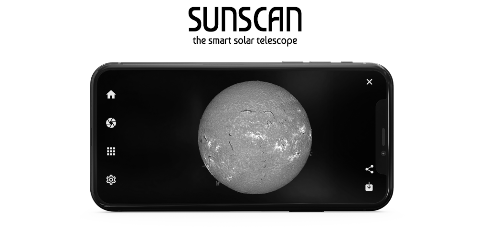

# Sunscan App

 <!-- Optional: Add a logo for your project -->

A work-in-progress open-source mobile application built using [Expo](https://expo.dev/). This application is designed to control the [Sunscan](https://www.sunscan.net/) astronomical instrument. 
This project was created by the STAROS team (Guillaume Bertrand, Christian Buil, Valérie Desnoux, Matthieu Le Lain).

## Table of Contents

- [Introduction](#introduction)
- [Getting Started](#getting-started)
- [Installation](#installation)
- [Running the App](#running-the-app)
- [Contributing](#contributing)
- [License](#license)
- [Acknowledgements](#acknowledgements)

## Introduction

The Sunscan is a revolutionary spectroheliograph designed to allow you to capture images of the Sun in minutes, directly from your smartphone. This complete and autonomous device is the result of several months of work by our team of enthusiasts. With the Sunscan, you will be able to explore the wonders of the Sun like never before. Thanks to this dedicated application, you will be able to control the Sunscan directly from your smartphone or tablet, making the experience even more intuitive and accessible. You will be able to make observations very simply and obtain images of our star automatically without any special knowledge, showing prominences, flares or even sunspots...

This project is currently under active development, and contributions are welcome! 

## Getting Started

These instructions will help you set up the project on your local machine for development and testing purposes.

### Prerequisites

- **Node.js** (v18.x or newer)
- **Expo CLI** (you can install it globally using `npm install -g expo-cli`)
- **Git** (for version control)
- **A text editor** (like VS Code)

### Installation

1. **Clone the repository**:
    ```bash
    git clone https://github.com/yourusername/sunscan-app.git
    ```

2. **Navigate into the project directory**:
    ```bash
    cd sunscan-app
    ```

3. **Install dependencies**:
    ```bash
    npm install
    ```

### Running the App

To run the application on your local machine:

1. **Start the Expo development server**:
    ```bash
    npm run start
    ```

2. **Run on an emulator or physical device**:
   - For iOS: Use the Expo Go app on your device or an iOS simulator.
   - For Android: Use the Expo Go app on your device or an Android emulator.

   You can scan the QR code provided by the Expo CLI or use the options in the terminal to run the app.

## Contributing

Contributions are what make the open-source community such an amazing place to learn, inspire, and create. Any contributions you make are **greatly appreciated**.

### How to Contribute

1. **Fork the Project**
2. **Create your Feature Branch** (`git checkout -b feature/AmazingFeature`)
3. **Commit your Changes** (`git commit -m 'Add some AmazingFeature'`)
4. **Push to the Branch** (`git push origin feature/AmazingFeature`)
5. **Open a Pull Request**

Please see our [Contributing Guidelines](CONTRIBUTING.md) for more details.

## License

Distributed under the GPLv3 License. See `LICENSE` for more information.


